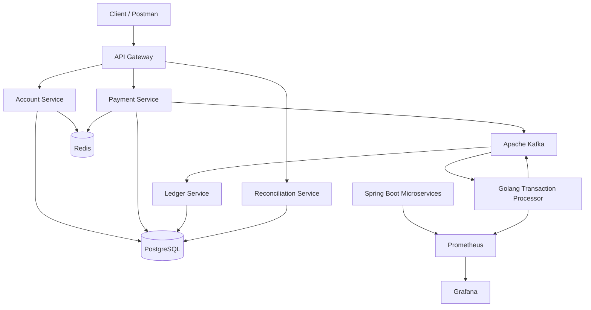
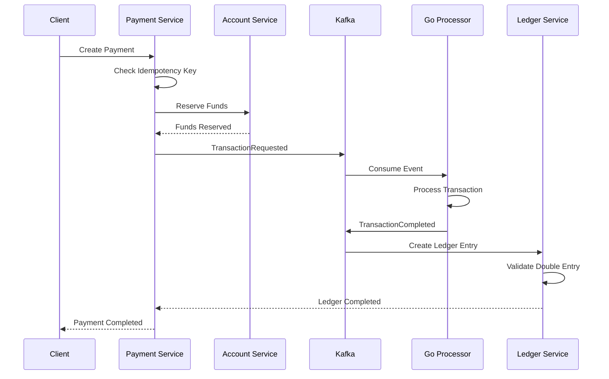

# FinFlow — Distributed Payment, Ledger & Reconciliation Platform

FinFlow is a production-style distributed payment processing platform designed to demonstrate modern backend engineering concepts including microservices, event-driven architecture, distributed transactions, idempotency, financial double-entry accounting, high-concurrency processing, observability, automated testing, containerization, and Kubernetes deployment.

The project combines Java/Spring Boot services with a concurrent Golang transaction processor and Apache Kafka for asynchronous communication.

---

## Architecture



---

## Core Features

* Java Spring Boot microservices
* Golang transaction processing service
* Apache Kafka event-driven communication
* Double-entry financial ledger
* Saga-based distributed transaction handling
* Idempotent payment processing
* High-concurrency transaction processing
* Payment reconciliation
* Redis caching
* PostgreSQL persistence
* Docker containerization
* Kubernetes deployment
* Prometheus metrics
* Grafana monitoring
* JUnit and Mockito unit testing
* Testcontainers integration testing
* GitHub Actions CI/CD
* AWS deployment support

---

## Technology Stack

### Backend

* Java 21
* Spring Boot
* Spring Data JPA
* Spring Kafka
* Golang
* REST APIs

### Messaging

* Apache Kafka

### Databases

* PostgreSQL
* Redis

### Testing

* JUnit
* Mockito
* Testcontainers
* Go testing
* Go race detector

### DevOps

* Docker
* Docker Compose
* Kubernetes
* GitHub Actions
* AWS

### Observability

* Spring Boot Actuator
* Prometheus
* Grafana

---

## Microservices

### API Gateway

Provides the main entry point for clients and routes requests to backend services.

### Account Service

Responsible for:

* Account creation
* Account lookup
* Balance management
* Fund reservation
* Fund release

### Payment Service

Responsible for:

* Payment creation
* Idempotency
* Payment state management
* Saga orchestration
* Payment events

### Transaction Processor

A Golang service responsible for concurrent transaction processing and Kafka event consumption.

### Ledger Service

Maintains the financial double-entry ledger.

Every successful financial transaction must satisfy:

```text
Total Debits = Total Credits
```

### Reconciliation Service

Periodically compares account balances against ledger-derived balances and detects inconsistencies.

---

## Payment Flow



---

## Double-Entry Ledger

For a payment of `$100` from Account A to Account B:

```text
Account A
    Debit  $100

Account B
    Credit $100
```

The transaction is valid only when:

```text
Debit Total = Credit Total
```

This prevents unbalanced financial transactions.

---

## Idempotency

FinFlow supports idempotent payment requests.

Example:

```http
POST /payments
Idempotency-Key: abc123
```

If the same request is submitted multiple times with the same idempotency key, the payment is processed only once.

```text
Request
   |
   v
Check Idempotency Key
   |
   +---- Existing ----> Return Previous Result
   |
   +---- New ---------> Process Payment
```

---

## Saga Transaction Management

FinFlow uses a Saga-style workflow for distributed payment processing.

```text
Create Payment
      |
      v
Validate Account
      |
      v
Reserve Funds
      |
      v
Process Transaction
      |
      +---- Failure ----> Release Funds
      |
      v
Create Ledger Entry
      |
      v
Complete Payment
```

If a later operation fails, previously completed operations can be compensated.

---

## Kafka Events

The platform uses Kafka topics for asynchronous communication.

Example topics:

```text
payment.created
payment.processing
payment.completed
payment.failed

transaction.requested
transaction.completed
transaction.failed

ledger.entry.created

account.balance.updated

reconciliation.completed
```

---

## Project Structure

```text
finflow/
│
├── services/
│   ├── api-gateway/
│   ├── account-service/
│   ├── payment-service/
│   ├── ledger-service/
│   ├── transaction-processor/
│   └── reconciliation-service/
│
├── infrastructure/
│   ├── docker/
│   ├── kubernetes/
│   ├── kafka/
│   ├── postgres/
│   ├── redis/
│   └── monitoring/
│
├── docs/
│   ├── architecture/
│   ├── diagrams/
│   ├── api/
│   └── decisions/
│
├── tests/
│   ├── integration/
│   └── performance/
│
├── .github/
│   └── workflows/
│
├── docker-compose.yml
├── README.md
└── .gitignore
```

---

## Running Locally

Clone the repository:

```bash
git clone https://github.com/YOUR_USERNAME/finflow-distributed-payment-platform.git

cd finflow-distributed-payment-platform
```

Start infrastructure:

```bash
docker compose up -d
```

Check running containers:

```bash
docker compose ps
```

Start the Spring Boot services from their respective directories.

Start the Golang transaction processor:

```bash
cd services/transaction-processor
go run .
```

---

## Testing

Run Java unit tests:

```bash
mvn test
```

Run Go tests:

```bash
go test ./...
```

Run Go race detection:

```bash
go test -race ./...
```

Integration tests use Testcontainers to create isolated infrastructure dependencies.

---

## High-Concurrency Testing

FinFlow includes tests designed to simulate concurrent payment requests.

Example scenario:

```text
Initial Account Balance: $10,000

100 concurrent transactions
Transaction amount: $100

Expected total transferred: $10,000
Expected final balance: $0
```

The test verifies:

* No duplicate payments
* No negative balances
* No lost transactions
* Correct ledger entries
* Debit/credit consistency
* Transaction isolation

---

## Observability

FinFlow exposes application metrics through Prometheus-compatible endpoints.

Example metrics include:

```text
HTTP request count
HTTP request latency
Payment success count
Payment failure count
Kafka processing metrics
Transaction processing latency
Database connection metrics
JVM metrics
```

Grafana dashboards visualize system health and payment-processing performance.

---

## Kubernetes

Kubernetes manifests are located under:

```text
infrastructure/kubernetes/
```

The deployment includes:

```text
API Gateway
Account Service
Payment Service
Ledger Service
Transaction Processor
Reconciliation Service
Kafka
PostgreSQL
Redis
```

---

## CI/CD

GitHub Actions performs:

```text
Code Checkout
     |
     v
Build
     |
     v
Unit Tests
     |
     v
Integration Tests
     |
     v
Docker Build
     |
     v
Container Validation
     |
     v
Deployment
```

---

## Engineering Challenges Demonstrated

This project focuses on real distributed-systems problems rather than simple CRUD functionality.

### Distributed Transactions

A payment involves multiple independent services. Saga-based transaction management is used instead of relying on a single database transaction.

### Idempotency

Repeated requests must not create duplicate financial transactions.

### Concurrency

Multiple transactions may attempt to modify the same account simultaneously. The system must maintain balance consistency.

### Eventual Consistency

Kafka-based asynchronous communication means some service state changes may occur at different times.

### Financial Consistency

Every completed financial transaction must maintain:

```text
Total Debits = Total Credits
```

### Failure Recovery

The Saga workflow supports compensating actions when downstream operations fail.

### Observability

Metrics and dashboards are used to identify failures, latency problems, and processing bottlenecks.

---

## Future Improvements

Potential future enhancements include:

* OAuth2 / OpenID Connect authentication
* JWT authorization
* Rate limiting
* Kafka schema registry
* Distributed tracing with OpenTelemetry
* Kafka partition optimization
* Outbox pattern
* Dead-letter queues
* Circuit breakers
* Kubernetes Horizontal Pod Autoscaling
* AWS EKS deployment
* Terraform infrastructure
* Load testing with Gatling or k6
* Multi-currency support
* Fraud detection service

---

